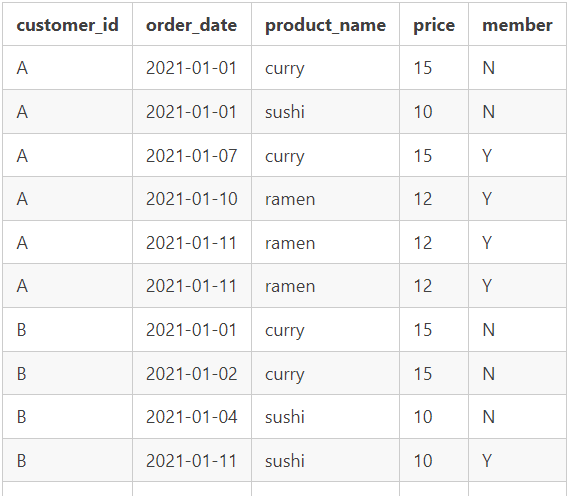

# Case Study#1

## Problem Task——————————————————————

The case study seeks to utilize customer data to unveil visiting patterns, expenditure habits, and preferred menu items for enhanced customer engagement. These insights will inform decisions on expanding the loyalty program. Basic datasets are required for convenient data inspection. Utilizing sample data from sales, menu, and members datasets

This challenge covers the following topics :

- Common Table Expressions
- Group By Aggregates
- Window Functions for ranking
- Table Joins

## **Case Study Questions———————————————————**

1. What is the total amount each customer spent at the restaurant?

```sql
SELECT
    s.customer_id,
    SUM(m.price) AS total_amount
FROM
    sales s
LEFT JOIN
    menu m ON s.product_id = m.product_id
GROUP BY
    s.customer_id;
```

1. How many days has each customer visited the restaurant?

```sql
SELECT
    customer_id,
    COUNT(DISTINCT order_date) AS number_of_days
FROM
    sales
GROUP BY
    customer_id;
```

1. What was the first item from the menu purchased by each customer?

```sql
WITH First_item AS
(
  SELECT s.customer_id
       , s.order_date
       , ROW_NUMBER() OVER (
         PARTITION BY s.customer_id
         ORDER BY
         s.order_date
         ) AS ranked
       , m.product_name
  FROM sales s
    JOIN menu m ON s.product_id = m.product_id
)
SELECT customer_id
     , product_name
FROM First_item
WHERE ranked = 1;
```

1. What is the most purchased item on the menu and how many times was it purchased by all customers?

```sql
WITH most_purchased AS
(
  SELECT m.product_name
       , s.product_id
       , COUNT(s.product_id) AS times
  FROM sales s
    JOIN menu m ON s.product_id = m.product_id
  GROUP BY s.product_id
         , m.product_name
)

SELECT product_name
     , times
FROM most_purchased
WHERE times = (SELECT MAX(times) FROM most_purchased); 
```

1. Which item was the most popular for each customer?

```sql
WITH most_popular AS
(
  SELECT s.customer_id
       , m.product_name
       , COUNT(s.product_id) AS times
       , ROW_NUMBER() OVER (PARTITION BY s.customer_id ORDER BY COUNT(s.product_id) DESC) AS ranked
  FROM sales s
    JOIN menu m ON s.product_id = m.product_id
  GROUP BY s.customer_id
         , m.product_name
)

SELECT customer_id
     , product_name
     , times
FROM most_popular
WHERE ranked = 1;
```

1. Which item was purchased just before the customer became a member?

```sql
WITH purcheased_before_membership AS
(
  SELECT s.customer_id
       , m.join_date
       , s.order_date
       , s.product_id
       , n.product_name
       , DENSE_RANK() OVER (PARTITION BY s.customer_id ORDER BY order_date DESC) AS ranked

  FROM menu n
    JOIN sales s ON n.product_id = s.product_id
    JOIN members m ON s.customer_id = m.customer_id
  WHERE m.join_date > s.order_date
)
SELECT customer_id
     , join_date
     , order_date
     , product_name
FROM purcheased_before_membership
WHERE ranked = 1;
```

1. Which item was purchased just before the customer became a member?

```sql
WITH purcheased_before_membership AS
(
  SELECT s.customer_id
       , m.join_date
       , s.order_date
       , s.product_id
       , n.product_name
       , DENSE_RANK() OVER (PARTITION BY s.customer_id ORDER BY order_date DESC) AS ranked

  FROM menu n
    JOIN sales s ON n.product_id = s.product_id
    JOIN members m ON s.customer_id = m.customer_id
  WHERE m.join_date > s.order_date
)
SELECT customer_id
     , join_date
     , order_date
     , product_name
FROM purcheased_before_membership
WHERE ranked = 1;
```

1. What is the total items and amount spent for each member before they became a member?

```sql
WITH total_items AS
(
  SELECT s.customer_id
       , m.join_date
       , s.order_date
       , s.product_id
       , n.product_name
       , n.price
       , DENSE_RANK() OVER (PARTITION BY s.customer_id ORDER BY order_date DESC) AS ranked
  FROM menu n
    JOIN sales s ON n.product_id = s.product_id
    JOIN members m ON s.customer_id = m.customer_id
  WHERE m.join_date > s.order_date
)
SELECT SUM(price) AS total
     , customer_id
FROM total_items
WHERE ranked = 1
GROUP BY customer_id;

```

1. If each $1 spent equates to 10 points and sushi has a 2x points multiplier - how many points would each customer have?

```sql
WITH points AS
(
  SELECT s.customer_id
       , m.price AS total_amount
       , product_name
       , CASE product_name
           WHEN 'sushi' THEN price * 20
           ELSE price * 10
         END AS point
  FROM sales s
    LEFT JOIN menu m ON s.product_id = m.product_id
)
SELECT customer_id
     , SUM(point)
FROM points
GROUP BY customer_id;
```

1. In the first week after a customer joins the program (including their join date) they earn 2x points on all items, not just sushi - how many points do customer A and B have

```sql
WITH total_items AS
(
  SELECT s.customer_id
       , m.join_date
       , s.order_date
       , s.product_id
       , n.product_name
       , n.price
       , DENSE_RANK() OVER (PARTITION BY s.customer_id ORDER BY order_date DESC) AS ranked
       , price * 20 AS point
  FROM menu n
    JOIN sales s ON n.product_id = s.product_id
    JOIN members m ON s.customer_id = m.customer_id
  WHERE m.join_date <= s.order_date
)
SELECT SUM(point) total
     , customer_id
FROM total_items
WHERE ranked = 1
GROUP BY customer_id;
```

## **Bonus Question**——————————————————————

The following questions are related creating basic data tables that can be can use to quickly derive insights without needing to join the underlying tables using SQL.

1. Join All The Things

Recreate the following table output using the available data:



```sql
SELECT s.customer_id
     , s.order_date
     , s.product_id
     , n.product_name
     , n.price
     , CASE
         WHEN m.join_date <= s.order_date THEN 'y'
         ELSE 'n'
       END AS members
FROM menu n
  JOIN sales s ON n.product_id = s.product_id
  LEFT JOIN members m ON s.customer_id = m.customer_id;
```

1. Rank All The Things

Recreate the following table output using the available data and include information about the ranking of member’s products only:


```sql
WITH ranking AS
(
  SELECT s.customer_id
       , s.order_date
       , s.product_id
       , n.product_name
       , n.price
       , CASE
           WHEN m.join_date <= s.order_date THEN 'y'
           ELSE 'n'
         END AS members
  FROM menu n
    JOIN sales s ON n.product_id = s.product_id
    LEFT JOIN members m ON s.customer_id = m.customer_id
)
SELECT customer_id
     , order_date
     , product_id
     , product_name
     , price
     , members
     , CASE
         WHEN members = 'y' THEN DENSE_RANK() OVER (PARTITION BY customer_id, members ORDER BY order_date)
         ELSE NULL
       END AS ranked
FROM ranking;
```